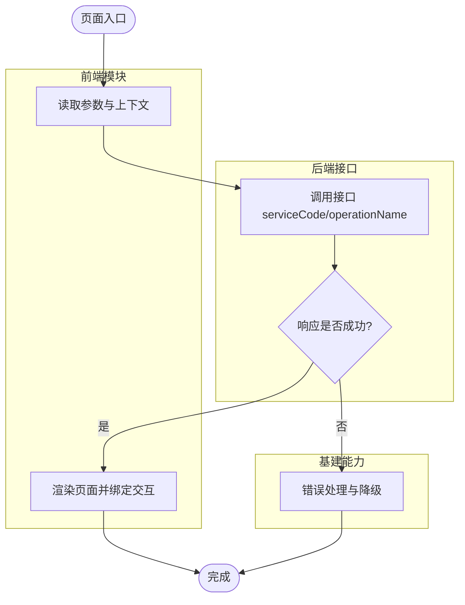

# design - [需求名称]

## 方案摘要

| 项目 | 内容 |
| :--- | :--- |
| 目标 | [一句话说明技术目标] |
| 范围 | [本次涉及/不涉及] |
| 实现策略 | [复用既有模式 + 新增差异点] |
| 风险与对策 | [主要风险 + 对应策略] |

---

## 参考实现映射

| 类型 | 参考路径 | 复用点 |
| :--- | :------- | :----- |
| 页面/模块 | `/abs/path/to/example` | [结构或数据流模式] |
| 组件 | `/abs/path/to/component` | [交互或状态管理模式] |
| 服务层 | `/abs/path/to/service` | [接口封装模式] |

---

## 代码变更地图

| 标签 | 文件路径 | 说明 |
| :--- | :------- | :--- |
| [NEW] | `/abs/path/to/new-file.ts` | [新增职责] |
| [MODIFY] | `/abs/path/to/existing-file.ts` | [修改内容] |
| [DELETE] | `/abs/path/to/obsolete-file.ts` | [删除原因] |

---

## UI 基线与实现载体约束

> 若未启用 D2C，请填写：`不适用`

### UI 基线继承范围

- 静态产物目录：[例如 `openspec/changes/<change-id>/d2c/`]
- 必须保持的视觉结构：[页面层级/区块关系/关键样式特征]
- 必须保持的交互路径：[入口/状态切换/反馈/出口]
- 必须保持的场景闭环：[主流程/异常流程/边界场景]

### 实现载体重定稿

- D2C 参考性质：[仅作为视觉与交互基线，不作为最终组件实现真源]
- 需要替换的 D2C 节点/组件：[列出需替换项]
- 最终采用的组件库/跨端组件：[列出正确实现载体]
- 替换原因：[组件库规范/跨端兼容/工程约束/可维护性]
- 替换后保持不变的内容：[视觉结果/交互路径/场景闭环]
- 明确禁止事项：[脱离设计擅自推翻 UI 基线/无依据重做布局与样式骨架]

---

## 技术实现流程图

> **说明**：技术流程图必须直接写入 design.md 正文，不再单独等待流程图确认。
>
> **要求**：
> - 标注接口名（`serviceCode/operationName`）、组件名、关键字段、数据流向、异常处理
> - 使用 `subgraph` 分区（前端模块/后端接口/基建能力）
> - 阶段三定稿时 MUST 调用一次 mcp__mermaid-mcp__mermaidTool 校验语法
> - 阶段四门禁时 MUST 再次调用 mcp__mermaid-mcp__mermaidTool 作为最终交付校验
> - 若 MCP 不可用，标注“⚠️ 未经 MCP 验证，建议手动检查”

---

## 关键数据源与契约

### 后端接口

#### `[serviceCode]/[operationName]`
- 用途：[功能用途]
- 调用时机：[触发点]
- 事实来源：[MCP:契约]

**入参**：

| 字段路径 | 类型 | 必填 | 来源 | 示例值 | 置信度 | 说明 |
| :------- | :--- | :--- | :--- | :----- | :----- | :--- |
| [字段名] | [类型] | [是/否] | [来源] | [示例] | ✅/🔧/⚠️ | [说明] |

> 规则：若 `来源=固定值`，说明中必须标注证据标签：`[MCP:契约枚举]` / `[MCP:契约默认值]` / `[代码库常量]` / `[用户确认]`。无证据时置信度必须为 `⚠️`，并进入 design 阶段问题确认。

**返回值**：

| 字段路径 | 类型 | 说明 | 示例值 |
| :------- | :--- | :--- | :----- |
| [字段名] | [类型] | [说明] | [示例] |

### 基建能力

#### `[ComponentName]/[APIName]`
- 用途：[功能用途]
- 使用方式：[直接使用/封装]
- 关键配置：[配置项]
- 约束：[已知限制]
- 事实来源：[MCP:基建] / [Skill] / [代码库:/abs/path]

---

## 核心实现要点（按文件）

### `[MODIFY] /abs/path/to/file.ts`
- 做什么：[功能变更]
- 怎么做：[参照模式 + 差异点；若启用 D2C，说明如何把 UI 基线映射为正确组件实现]
- 注意事项：[边界/异常处理]

> 规则：核心实现要点中不得保留实施阻塞固定配置项的“待产品提供/占位符/来源不明”描述；应引用已确认值或确认来源。

### `[NEW] /abs/path/to/file.ts`
- 做什么：[新增能力]
- 怎么做：[与现有模块衔接]
- 注意事项：[可维护性/扩展性]

---

## 验证计划

### 自动化验证
- [命令 1，例如 `pnpm test --filter xxx`]
- [命令 2，例如 `pnpm lint`]

### 手动验证
- [场景 1：主流程]
- [场景 2：异常流程]
- [场景 3：边界条件]

---

## 验收标准

- [ ] 流程图与契约字段一致
- [ ] 代码变更地图与实现要点一致
- [ ] 核心异常路径具备处理策略
- [ ] 文档可让评审者在 3-5 分钟内理解主要实现方案

---

## 变更日志

### Round 1 (2026-XX-XX)
- [初始 design 生成]

### Round 2 (2026-XX-XX)
- [根据用户评审意见修订]
