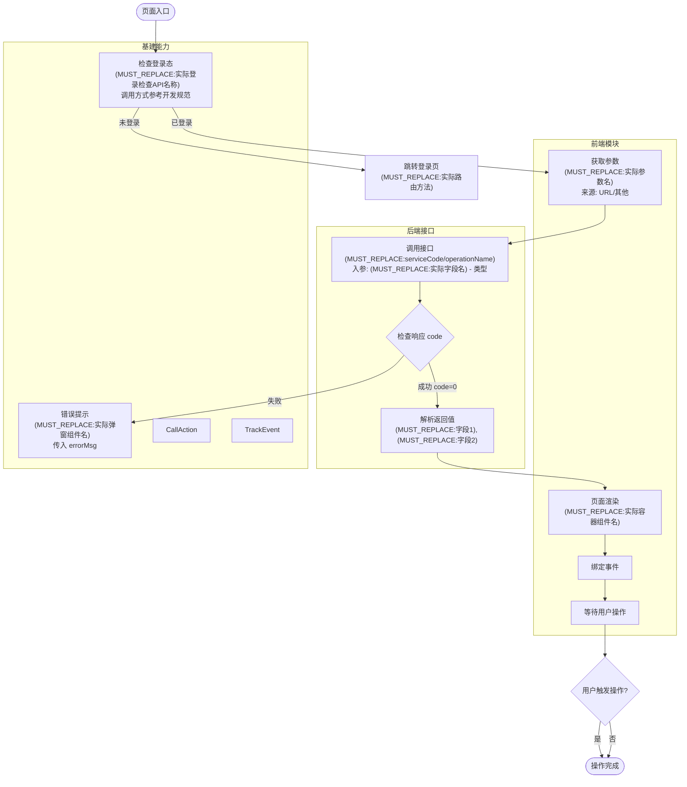

# design - [需求名称]

> **说明**：本文档是基于 proposal.md 的技术设计方案，所有设计决策都已与用户确认。

---

## 📁 代码变更范围

> **说明**：基于代码库探索和最佳实践，确定的文件变更清单。

### 影响范围

| 模块     | 文件路径              | 操作 | 变更说明    |
| :------- | :-------------------- | :--- | :---------- |
| [模块名] | `/xxx/xxx/index.jsx`  | 新建 | [说明]      |
| [模块名] | `/xxx/xxx/service.js` | 修改 | 增加 [内容] |

### 共享资源与风险点

| 资源           | 影响 | 风险/建议        |
| :------------- | :--- | :--------------- |
| `package.json` | 全局 | 确认依赖版本兼容 |

---

## 🔧 技术实现流程图

> **流程图绘制要求 (CRITICAL!)**：
>
> 1. **技术视角**：必须在 proposal.md 的业务流程图基础上，补充技术实现细节
> 2. **必须标注的技术元素**：
>    - **接口名称**：标注格式 `serviceCode/operationName`，必须是通过 MCP 查询到的真实接口
>    - **组件名称**：标注格式 `功能描述-组件库名称`（如 `弹窗-ModalComponent`），必须是通过 MCP 或代码库查询到的真实组件
>    - **关键字段**：标注接口入参和返回值的关键字段名
>    - **数据流向**：标注参数从哪里来、传递到哪里（如 `字段名: 从 URL 参数获取 → 传入接口`）
>    - **异常处理**：标注错误码、异常分支的处理逻辑
> 3. **使用 subgraph 分区**：按功能模块、前后端、基建组件等维度分区，提高可读性
> 4. **完整流程**：必须包含所有主流程、分支流程、异常流程
> 5. **CRITICAL**：严禁直接复用下方示例中的占位符名称（如 `ServiceA/operationB`），必须基于实际项目的 MCP 查询结果填写真实值
>
> **Mermaid 语法规范**（为确保在所有渲染器中正常显示，必须严格遵守）：
>
> - **声明**：使用 `graph TD` 作为首行声明
> - **节点定义**：严禁直接连接文字，必须使用 `ID[文字]` 格式
>   - ✅ 正确：`A[入口] --> B{条件}`
>   - ❌ 错误：`入口 --> 条件`
> - **形状规范**：
>   - 开始/结束：`([文字])` —— 药丸形
>   - 普通步骤：`[文字]` —— 矩形
>   - 判断/分支：`{文字}` —— 菱形
> - **特殊字符**：节点文字内若含特殊符号，必须包裹在双引号内
>
> **CRITICAL**: 流程图在展示给用户前，SHOULD 调用 mermaid-mcp 工具验证语法正确性，确保可以正常渲染。若 MCP 服务不可用，跳过自动验证，在文档中标注"⚠️ 未经 MCP 验证，建议手动检查"，继续执行。若验证失败，修复后重新验证，直到通过。

### 标准示例（参考模板）

> **⚠️ CRITICAL - 占位符使用警告**
>
> 下方示例**仅作为格式参考**，所有占位符使用`[MUST_REPLACE:...]`格式标注。
>
> **严禁直接复制占位符到实际流程图！**你必须：
>
> 1. 通过 MCP 契约查询获取真实的 serviceCode/operationName
> 2. 通过 MCP 基建查询获取真实的组件名/API 名
> 3. 通过代码库探索获取真实的字段名和方法名
>
> 如果你的流程图中仍包含`[MUST_REPLACE:...]`标记，说明查询工作未完成。



**占位符替换检查清单（D-5-1任务必须完成）：**

- [ ] 所有`(MUST_REPLACE:serviceCode/operationName)`已替换为MCP契约查询结果
- [ ] 所有`(MUST_REPLACE:实际...API名称)`已替换为MCP基建查询结果
- [ ] 所有`(MUST_REPLACE:实际...组件名)`已替换为MCP基建查询或代码库探索结果
- [ ] 所有`(MUST_REPLACE:字段/参数)`已替换为契约查询或代码分析结果
- [ ] 流程图已通过mermaid-mcp验证（若MCP服务可用）

### 实际流程图

```mermaid
[在这里填写实际的技术实现流程图]
```

---

## 🧾 外部依赖与接口

> **说明**：所有接口和组件都已通过 MCP 查询验证，确保事实准确。

### 后端接口

#### `[serviceCode]/[operationName]`

- **用途**：[功能描述]
- **调用时机**：[何时调用]
- **事实依据**：[MCP:契约]

**入参**（根据 `get_contract_doc` 返回的契约填写）：

> **字段推导层级说明**（基于 Priority Waterfall 原则）：
> - ✅ **L1 Explicit**：proposal 中明确标注的字段，直接引用原文
> - 🔧 **L2 Pattern**：通过模式匹配推导的字段（如登录态、常见参数），已添加默认假设
> - ⚠️ **L3 Ambiguous**：来源不明或存在歧义的字段，需在待决策问题中确认
>
> L2 字段遵循"静默原则"：若用户无异议，视为确认；若有疑问，可在评审阶段提出。

| 字段路径          | 类型   | 必填    | 数据来源       | 示例值 | 推导层级 | 说明   |
| :---------------- | :----- | :------ | :------------- | :----- | :------- | :----- |
| [字段名]          | [类型] | [是/否] | [前端取值来源] | [示例] | ✅/🔧/⚠️ | [说明] |
| [父字段].[子字段] | [类型] | [是/否] | [前端取值来源] | [示例] | ✅/🔧/⚠️ | [说明] |

> **嵌套展开规则**：当契约中字段类型为 `object` 或 `array` 时，**必须**使用 `父字段.子字段` 格式展开所有层级。

**返回值**（根据 `get_contract_doc` 返回的契约填写）：

| 字段路径          | 类型   | 说明       | 示例值 |
| :---------------- | :----- | :--------- | :----- |
| [字段名]          | [类型] | [用途说明] | [示例] |
| [父字段].[子字段] | [类型] | [用途说明] | [示例] |

---

### 基建组件

#### `[ComponentName]/[APIName]`

- **用途**：[功能描述]
- **事实依据**：[MCP:基建] / [Skill] / [代码库:path/to/file]
- **使用方式**：[直接使用/封装]
- **关键配置**：[配置项]
- **限制**：[已知限制]

---

## ✅ 验收标准

### 通用标准

- [ ] 技术实现流程图标注了所有关键技术元素（接口名、组件名、字段、数据流向）
- [ ] 接口调用符合「外部依赖与接口」章节
- [ ] 代码变更符合「代码变更范围」章节

### 非 TDD 模式

- [ ] 代码审查无明显逻辑错误
- [ ] 边界条件和异常处理已落实

### TDD 模式（若启用）

- [ ] 核心需求逻辑有测试覆盖
- [ ] 测试通过

---

## 📝 变更日志

> 记录设计方案的迭代历史（可选）

### Round 1 (2026-XX-XX)

- 初始设计生成

### Round 2 (2026-XX-XX)

- [描述本轮的主要变更]
