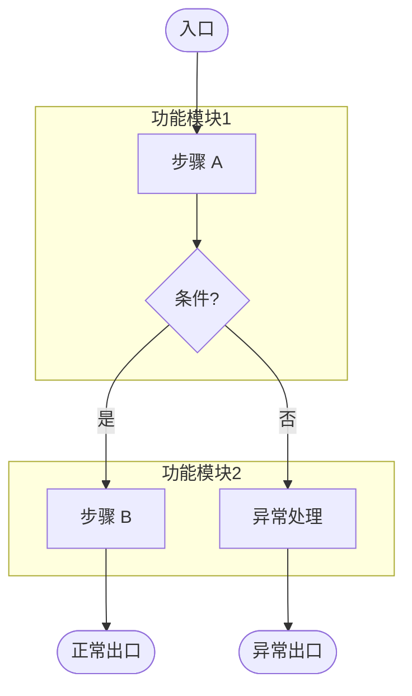

# proposal - [需求名称]

## 需求概述

> 简要概述需求背景和核心价值

---

## 业务逻辑流程图

> **流程图绘制要求**：
> 1. 必须包含所有主流程、分支流程、异常流程
> 2. 使用 subgraph 对功能点进行分区，提高可读性
> 3. 严格遵守 Mermaid 语法规范（见下方说明）
> 4. **业务视角**：本阶段的流程图聚焦业务逻辑，使用业务术语，不标注技术实现细节（技术细节将在 design.md 的技术实现流程图中补充）
>
> **Mermaid 语法规范**（为确保在所有渲染器中正常显示，必须严格遵守）：
>
> - **声明**：使用 `graph TD` 作为首行声明
> - **节点定义**：严禁直接连接文字，必须使用 `ID[文字]` 格式
>   - ✅ 正确：`A[入口] --> B{条件}`
>   - ❌ 错误：`入口 --> 条件`
> - **形状规范**：
>   - 开始/结束：`([文字])` —— 药丸形
>   - 普通步骤：`[文字]` —— 矩形
>   - 判断/分支：`{文字}` —— 菱形
> - **特殊字符**：节点文字内若含特殊符号（如 `?`、`!`、`&`），必须包裹在双引号内
>   - 示例：`A["步骤(带括号)"]`
>
> **输出格式**：仅输出 Mermaid 代码块，不输出任何多余的解释文字或 Markdown 标题
>
> **CRITICAL**: 流程图在展示给用户前，SHOULD 调用 mermaid-mcp 工具验证语法正确性，确保可以正常渲染。若 MCP 服务不可用，跳过自动验证，在文档中标注"⚠️ 未经 MCP 验证，建议手动检查"，继续执行。若验证失败，修复后重新验证，直到通过。

---

## 功能逻辑详述

> **说明**：按重要性划分详细描述需求功能点
>
> **重要约束**：
> - 使用中文业务术语，严禁出现代码变量名、API 路径、数据库字段
> - 必须明确标注各功能的端支持情况（APP / 小程序 / H5）
> - 所有功能点必须在本章节列出，不要遗漏

| 功能点 | 说明 | 端支持 | 优先级 |
|-------|------|-------|-------|
| [功能点 1] | [功能说明] | APP/小程序/H5 | P0/P1/P2 |
| [功能点 2] | [功能说明] | APP/小程序/H5 | P0/P1/P2 |

---

## 多端支持说明

> **多端架构理解**：
> - **支持端**：APP、小程序、H5 三种形态
> - **关键约束**：H5 默认内嵌于宿主（APP/小程序）
>   - 宿主与 H5 共用登录态
>   - 需关注资源位配置、宿主调用等交互边界
>   - H5 需思考是否需要登录，登录时跳转到登录页

| 端类型 | 支持情况 | 特殊说明 |
|-------|---------|---------|
| APP | [是/否] | [特殊说明，如特定版本要求] |
| 小程序 | [是/否] | [特殊说明] |
| H5 | [是/否] | [特殊说明，如宿主内嵌还是独立访问] |

---

## 需求修改建议

> **说明**：基于技术可行性和最佳实践，对原始需求提出的优化建议（可选）

**建议 1**：[建议标题]
- **原需求**：[描述原需求中的某个点]
- **建议修改为**：[建议的修改方案]
- **理由**：[技术原因或最佳实践依据]

**建议 2**：...

---

## 📝 变更日志

> 记录每一轮的修改历史

### Round 1 (2026-XX-XX)
- [描述本轮的主要变更]
- [如：新增功能点 X、修改业务流程 Y]

### Round 2 (2026-XX-XX)
- [描述本轮的主要变更]
