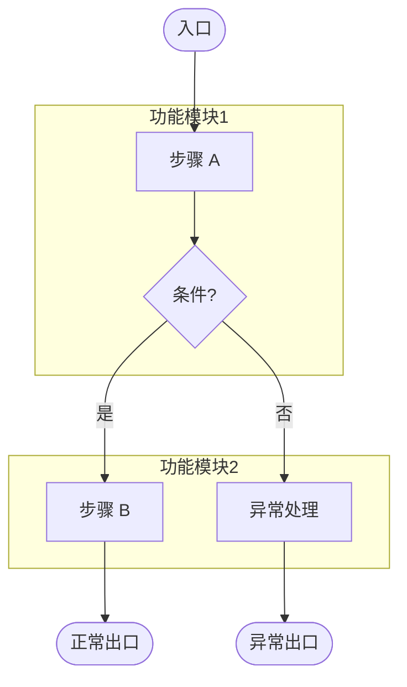

# spec - [需求名称]

## 需求摘要

### 目标

[一句话说明本次变更要解决的问题]

### 范围

[本次包含什么，不包含什么]

#### Scope 边界

**本仓库负责（N项）**
- [功能点1]
- [功能点2]

**外部依赖（N项）**
- [功能点A] — [依赖哪个服务/系统]

**待确认（N项）**
无

### 非目标

[本次明确不处理什么]

### 关键决策

- [决策1]
- [决策2]

---

<!-- CONDITIONAL: 仅在项目涉及 D2C 场景时生成以下章节 -->
## D2C 配置

- 是否启用 D2C：[是/否]
- 变更类型：[new/modify]
- 设计材料：[启用时填写材料数量与关键说明摘要；未启用时填"无"]
- 目标范围：[page/module/component]
- D2C 定位：[若启用，填写"仅作为视觉与交互基线，不作为最终组件实现依据"；否则填"不适用"]

<!-- D2C_ENABLED: false -->
<!-- D2C_CHANGE_KIND: new -->
<!-- D2C_TARGET_SCOPE: page -->
<!-- D2C_MATERIALS_JSON: [] -->
<!-- D2C_BASELINE_FROZEN: false -->
<!-- D2C_BASELINE_FROZEN_AT: -->

---

## 业务逻辑流程图

> **说明**：流程图是 spec 的正文产物，必须直接写入文档，不再单独等待流程图确认。
>
> **要求**：
> - 必须覆盖主流程、分支流程、异常流程
> - 使用 `subgraph` 按功能块分区
> - 使用业务术语，不写技术实现细节
> - 阶段三定稿时 MUST 调用一次 mcp__mermaid-mcp__mermaidTool 校验语法
> - 阶段四门禁时 MUST 再次调用 mcp__mermaid-mcp__mermaidTool 作为最终交付校验
> - 若 MCP 不可用，标注"⚠️ 未经 MCP 验证，建议手动检查"
> - 若存在接口，按照 `serviceCode/operationName` 格式记录，方便 design 阶段调用 mcp

---

## 需求清单

### 需求项 1：[需求标题]

**用户故事**：作为[角色]，我希望[目标能力]，以便[业务价值]。

#### 验收标准

1. 当[触发事件]时，系统应当[系统响应]。
2. 若[前置条件/异常条件]，则系统应当[处理结果]。
3. 在[持续状态]期间，系统应当[持续行为]。
4. 在[特定场景]场景下，系统应当[特定行为]。

### 需求项 2：[需求标题]

**用户故事**：作为[角色]，我希望[目标能力]，以便[业务价值]。

#### 验收标准

1. 当[触发事件]时，系统应当[系统响应]。
2. 若[前置条件/异常条件]，则系统应当[处理结果]。
3. 系统应当[普遍性要求]。
4. 在[特定场景]场景下，系统应当[特定行为]。

---

<!-- CONDITIONAL: 仅在项目涉及多端场景时生成以下章节 -->
## 多端支持说明

| 端类型 | 支持情况 | 特殊说明 |
| :----- | :------- | :------- |
| APP | [是/否] | [版本或能力约束] |
| 小程序 | [是/否] | [平台差异说明] |
| H5 | [是/否] | [宿主内嵌/独立访问说明] |

---

## 验证与评审关注点

- [ ] 业务流程图与需求清单一致
- [ ] 每个需求项都包含可验证的验收标准
- [ ] Scope 技术明细附录包含所有"本仓库负责"功能点的代码路径
- [ ] 关键决策可被业务方快速理解
- [ ] 文档中不包含待决策问题章节（问题应在讨论阶段收口）

---

## 变更日志

### Round 1 (2026-XX-XX)
- [初始 spec 生成]

### Round 2 (2026-XX-XX)
- [根据用户评审意见修订]

---

## 附录

### Scope 技术明细（供 design 阶段参考）

| 功能点 | 仓库中已有实现 | 改造预判 |
| :----- | :------------- | :------- |
| [功能点1] | [相关代码路径/模块，或"无"] | [新增/改造/复用] |
| [功能点2] | [相关代码路径/模块，或"无"] | [新增/改造/复用] |
