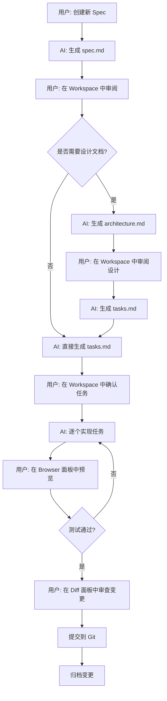

# SpecForge：实践 Spec Coding 的现代化工作流工具

## 引言

在 AI 辅助开发的时代，开发者面临一个共同的挑战：**如何确保 AI 编码助手准确理解需求并生成可预测的代码**？传统的模糊提示往往导致不可预测的结果，需要多次迭代才能达到预期目标。

**Spec Coding（规范驱动开发）**正是为解决这一问题而生。它的核心理念是：**在编写任何代码之前，先让人类和 AI 就要构建的内容达成一致**。通过轻量级的规范层，确保需求在实现之前就被明确定义和验证。

**SpecForge** 是一套完整的工具链，旨在将 Spec Coding 理念落地为可操作的工作流，是一个集成了规范管理、实时预览、版本控制的现代化开发环境。

---

## SpecForge 架构概览

SpecForge 由两个核心组件构成：

### 1. CLI 工具

作为全局命令行工具，SpecForge CLI 负责：
- 启动本地或远程服务器
- 集成 Claude Code SDK
- 管理会话进程生命周期
- 提供配置和认证功能

```bash
# 本地开发
npx @ctrip/spec-forge@latest --port 3400

# 远程服务器部署
docker run --rm -p 3400:3400 \
  -v ~/.claude:/root/.claude \
  -e CCV_PASSWORD=secure-password \
  -e ANTHROPIC_API_KEY=... \
  spec-forge-viewer
```

### 2. Viewer（Web 客户端）

基于现代 Web 技术栈构建的功能完整的 Claude Code 客户端，提供：
- 会话历史浏览和搜索
- 实时会话交互
- 规范管理面板（Spec Dashboard）
- 浏览器预览面板
- Git 集成和 Diff 查看
- 多语言支持（中/英）

### 与 Claude Code 的集成

SpecForge 深度集成 `@anthropic-ai/claude-code` SDK，实现：

```typescript
// 会话启动
ClaudeCode.query(generateMessages(), {
  resume: task.def.baseSessionId,
  cwd: sessionProcess.def.cwd,
  abortController: sessionProcess.def.abortController,
  env: normalizedEnv,
  ...permissionOptions,
})
```

**关键特性**：
- **Keep-Alive 进程管理**：会话在后台保持运行，支持无缝继续
- **虚拟会话**：在 JSONL 文件创建前，在内存中维护临时会话数据
- **零延迟消息显示**：用户消息立即显示，无需等待 AI 响应

### 与 OpenSpec 的关系

SpecForge 在 OpenSpec 1.0 发布后（变得更原子化、支持自定义 schema），**SpecForge 将自研方案迁移到了 OpenSpec 的 schema 系统上**。

这意味着：
1. **兼容性**：SpecForge 完全兼容 OpenSpec 的目录结构和文件格式
2. **可扩展性**：用户可以自定义 schema 来适配不同的工作流
3. **独立性**：两者仍是独立项目，SpecForge 专注于提供可视化和交互层

---

## Spec Coding 工作流程

在 SpecForge 中，一个完整的 Spec Coding 工作流遵循以下阶段：

### 工作流状态机

```
draft (草稿)
  ↓
designing (设计中)
  ↓
design-confirmed (设计确认)
  ↓
task-planning (任务规划)
  ↓
implementing (实施中)
  ↓
completed (已完成)
  ↓
archived (已归档)
```

### 文件结构

每个变更（Change）存储在 `openspec/changes/<change-name>/` 目录下：

```
openspec/
├── changes/
│   ├── add-authentication/
│   │   ├── spec.md          # 为什么做、做什么
│   │   ├── architecture.md      # 技术方案和架构决策（或 design.md）
│   │   ├── tasks.md            # 实现清单（checkbox 格式）
│   │   ├── tests.md            # 测试计划
│   │   ├── specs.md            # 根规范（可选）
│   │   └── specs/              # Delta specs（ADDED/MODIFIED/REMOVED）
│   │       └── auth/
│   │           └── spec.md
│   └── archive/                # 已归档的变更
└── specs/                      # 真理源（当前系统行为）
    └── auth/
        └── spec.md
```

### 状态推断机制

SpecForge 通过文件内容中的标记自动推断变更状态：

```typescript
// tasks.md 中的标记
<!-- TASKS_CONFIRMED: true -->

// design.md 或 architecture.md 中的标记
<!-- DESIGN_FINAL_CONFIRMATION: true -->
```

**状态推断逻辑**：
1. 如果所有任务（`- [x]`）都已完成 → `completed`
2. 如果任务已确认但未完成 → `implementing`
3. 如果存在 tasks.md 但未确认 → `task-planning`
4. 如果设计已最终确认 → `design-confirmed`
5. 如果存在 design.md 但未确认 → `designing`
6. 否则 → `draft`

### 典型工作流示例



---

## Workspace：交互中心

**Workspace** 是一个**可调整大小的右侧面板**，支持三种工作模式，贯穿整个 Spec Coding 流程。

### 架构设计

```typescript
export type PanelMode = "browser" | "spec" | "diff" | "none";

export interface WorkspacePanelContextType {
  activeMode: PanelMode;
  panelWidth: number; // 百分比（20%-80%）

  // Browser 模式
  browserUrl: string | null;
  openBrowser: (url: string) => void;
  closeBrowser: () => void;
  reloadBrowser: () => void;

  // Spec 模式
  specContext: unknown | null;
  openSpec: (context: unknown) => void;
  closeSpec: () => void;

  // 通用操作
  closePanel: () => void;
}
```

### 模式 1：Spec 模式

**用途**：规范管理和查看的交互界面

**核心功能**：
- **Spec Dashboard**：展示所有活跃和归档的变更
- **状态可视化**：通过图标和颜色区分不同状态
- **内容编辑**：直接在面板中编辑 spec、design、tasks 等文件
- **实时同步**：通过 SSE 事件实时更新变更列表

**状态图标系统**：
```typescript
const StatusIcon = ({ status }) => {
  switch (status) {
    case "draft":
      return <FileText className="text-slate-400" />
    case "designing":
    case "design-confirmed":
    case "task-planning":
      return <CircleDashed className="text-blue-500" />
    case "implementing":
      return <Clock className="text-yellow-500" />
    case "completed":
      return <CheckCircle2 className="text-purple-500" />
    case "archived":
      return <CheckCircle2 className="text-green-500" />
  }
}
```

**用户体验亮点**：
- 点击变更卡片即可在右侧面板展开详情
- 支持折叠/展开归档变更
- 新建 Spec 对话框内联在面板中
- 显示变更描述（从 spec.md 第一段提取）

### 模式 2：Browser 模式

**用途**：实时预览 Web 应用和验证功能

**核心功能**：
- **嵌入式 iframe**：在开发环境中直接预览应用
- **URL 输入和导航**：支持手动输入 URL 或点击链接跳转
- **同源 URL 追踪**：自动更新地址栏（跨域则显示原 URL）
- **刷新功能**：重新加载预览页面
- **域名黑名单**：智能检测无法嵌入的网站（如 GitHub、Google）

**安全沙箱**：
```html
<iframe
  src={browserUrl}
  sandbox="allow-scripts allow-same-origin allow-forms
           allow-popups allow-popups-to-escape-sandbox"
/>
```

**典型使用场景**：
1. **本地开发服务器预览**：`http://localhost:5173`
2. **API 响应验证**：查看 JSON 或 HTML 输出
3. **UI 组件调试**：实时查看样式和交互效果
4. **文档浏览**：在开发过程中参考外部文档

### 模式 3：Diff 模式

**设计意图**：Git 变更对比和审查

虽然当前 Diff 功能主要通过独立的 Modal 实现，但 Workspace 架构已预留 `diff` 模式，正在整合：
- 文件变更列表
- Side-by-side 或 unified diff 视图
- 提交前审查流程
- 与 Spec 的关联（哪些任务对应哪些文件变更）

### 模式 4：d2c（Design-to-Code）能力（进行中）

**d2c（设计稿转代码）能力**将作为第四种模式加入 Workspace：

**功能**：
- 解析设计资产（Figma、图片等）
- AI 自动生成对应的代码结构
- 实时预览生成的组件
- 与 Spec 模式联动（生成 spec 和 tasks）

**架构优势**：
- Workspace 的可调整面板设计天然适合展示设计稿和代码对比
- 与现有的 Browser 模式配合，可以立即预览生成的代码效果
- 统一的状态管理和交互模式，降低用户学习成本

### 技术实现细节

**可调整大小的面板**：
```typescript
const handleMouseDown = (e: React.MouseEvent) => {
  isResizingRef.current = true;
  setIsResizing(true);
}

useEffect(() => {
  const handleMouseMove = (e: MouseEvent) => {
    if (!isResizingRef.current) return;
    const newWidth =
      ((window.innerWidth - e.clientX) / window.innerWidth) * 100;
    setWidth(Math.max(20, Math.min(80, newWidth))); // 限制在 20%-80%
  }
  // ...
}, [])
```

**状态管理**：
- 使用 React Context 全局管理 Workspace 状态
- 每种模式有独立的状态（browserUrl、specContext 等）
- 支持模式间的快速切换而不丢失状态

**响应式设计**：
- 在桌面端显示为固定宽度的右侧面板
- 在移动端可切换为全屏模态框
- 拖拽调整宽度时禁用页面选择和事件（`userSelect: none`）

---

## 架构决策

### 1. 为什么选择 Web 化？

**传统 CLI 的局限性**：
- 历史会话难以浏览和搜索
- 无法在移动设备上访问
- 团队协作需要额外工具
- 缺乏可视化的状态管理

**Web 化的优势**：
- **跨平台访问**：任何设备、任何浏览器
- **丰富的 UI**：图形化界面、拖拽调整、模态框等
- **实时协作**：多人同时查看会话进度
- **远程开发友好**：在服务器上运行 SpecForge，通过浏览器访问

### 2. 实时同步机制（SSE）

**为什么使用 SSE 而非 WebSocket？**

| 特性 | SSE | WebSocket |
|------|-----|-----------|
| **复杂度** | 简单（单向流） | 复杂（双向通信） |
| **自动重连** | 浏览器原生支持 | 需要手动实现 |
| **类型安全** | 易于实现 | 需要额外封装 |
| **适用场景** | 服务器推送事件 | 双向实时通信 |

**SpecForge 的场景**：
- 服务器需要通知客户端文件变化、会话状态更新
- 客户端的操作通过 Hono RPC（HTTP）完成
- 单向推送 + HTTP 请求的组合更简单且足够

**TypeSafeSSE 实现**：
```typescript
interface SSEEventDeclaration {
  connect: { timestamp: string }
  heartbeat: { timestamp: string }
  sessionListChanged: { projectId: string }
  sessionChanged: { projectId: string; sessionId: string }
  sessionProcessChanged: { processes: SessionProcess[] }
  permissionRequested: { permissionRequest: PermissionRequest }
  virtualConversationUpdated: { projectId: string; sessionId: string }
}

// 客户端订阅
useServerEventListener("sessionChanged", ({ projectId, sessionId }) => {
  queryClient.invalidateQueries({
    queryKey: ["session", projectId, sessionId]
  })
})
```

### 3. 数据完整性保障（Zod Schema）

**零信息丢失承诺**：

SpecForge 使用严格的 Zod Schema 验证所有 JSONL 日志内容：

```typescript
const ConversationSchema = z.union([
  UserEntrySchema,
  AssistantEntrySchema,
  SummaryEntrySchema,
  SystemEntrySchema,
  FileHistorySnapshotEntrySchema,
  QueueOperationEntrySchema,
  ProgressEntrySchema,
])
```

**23 个 Schema 文件覆盖所有字段**：
- 任何不符合 Schema 的数据都会触发验证错误，而非静默丢弃
- Schema 自动生成 TypeScript 类型，避免类型不一致
- 随着 Claude Code 版本演进，持续完善 Schema

### 4. Effect-TS 函数式副作用管理

**为什么选择 Effect-TS？**

后端涉及大量 I/O 操作（文件读取、命令执行、进程管理），Effect-TS 提供：

1. **统一的副作用处理模型**：
```typescript
const getChanges = (projectId: string) =>
  Effect.gen(function* () {
    const { project } = yield* projectRepository.getProject(projectId)
    const exists = yield* fs.exists(changesDir)
    const entries = yield* fs.readDirectory(changesDir)
    // ...
  })
```

2. **类型安全的错误处理**：
```typescript
Effect<Success, ProjectPathNotFoundError | OpenSpecDirectoryNotFoundError>
```

3. **完整的依赖注入**：
```typescript
MainLayer =
  PresentationLayer
    .pipe(Layer.provide(ApplicationLayer))
    .pipe(Layer.provide(DomainLayer))
    .pipe(Layer.provide(InfraLayer))
    .pipe(Layer.provide(PlatformLayer))
```

4. **可测试性**：
```typescript
test("example", async () => {
  const result = await Effect.runPromise(
    yourEffect.pipe(Effect.provide(testPlatformLayer))
  )
  expect(result).toBe(expectedValue)
})
```

**设计原则**：
- **优先使用纯函数**：只在必须处理副作用时才使用 Effect-TS
- **避免 Node.js 内置模块**：使用 `FileSystem.FileSystem` 而非 `node:fs`，实现跨平台和可测试性

### 5. Hono RPC + TanStack Query

**端到端类型安全**：

```typescript
// 后端定义（src/server/hono/route.ts）
export type RouteType = typeof app

// 前端调用（完全类型安全）
export const honoClient = hc<RouteType>("/")
const response = await honoClient.api.projects[":projectId"].$get({
  param: { projectId }
})
```

**TanStack Query 的价值**：
- **自动缓存失效**：结合 SSE 事件，实现精准的缓存失效策略
- **乐观更新**：用户操作立即反馈，后台同步
- **减少重复请求**：自动去重和批处理

---

## 技术栈概览

### 前端

| 技术 | 用途 | 选择原因 |
|------|------|---------|
| **React 19** | UI 框架 | 最新特性（Suspense、Transitions） |
| **Vite** | 构建工具 | 快速的开发体验 |
| **TanStack Router** | 路由管理 | 类型安全的路由 |
| **TanStack Query** | 服务器状态 | 自动缓存和同步 |
| **Biome** | Linter/Formatter | 统一的代码质量工具 |
| **@lingui/react** | 国际化 | 轻量级 i18n 方案 |

### 后端

| 技术 | 用途 | 选择原因 |
|------|------|---------|
| **Hono** | Web 框架 | 轻量、高性能、类型安全 |
| **Effect-TS** | 副作用管理 | 函数式编程、依赖注入 |
| **Zod** | Schema 验证 | 类型安全的运行时验证 |
| **esbuild** | 构建工具 | 极快的构建速度 |
| **Node 22** | 运行时 | 最新的 LTS 版本 |

### 开发工具

| 技术 | 用途 |
|------|------|
| **TypeScript** | 类型系统（`@tsconfig/strictest`） |
| **Vitest** | 单元测试 |
| **Playwright** | E2E 可视化回归测试 |
| **Docker** | 容器化部署 |

### 质量保证

**开发流程**：
```bash
# 类型检查（提交前必须）
pnpm typecheck

# 自动修复 Lint 和格式化问题
pnpm fix

# 单元测试
pnpm test

# E2E 快照测试
pnpm e2e
```

**Git Hooks**（lefthook）：
- 提交前自动运行 `pnpm fix`

---

## 使用场景

### 场景 1：本地开发增强

```bash
# 启动 SpecForge
npx @ctrip/spec-forge@latest --port 3400

# 打开浏览器访问 http://localhost:3400
```

**优势**：
- 更好的 UI：图形化界面、搜索、过滤
- 历史会话浏览：快速找到之前的对话
- Workspace 面板：同时查看 Spec、预览、Diff

### 场景 2：远程服务器开发

```bash
# 在远程服务器上运行
docker run --rm -p 3400:3400 \
  -v ~/.claude:/root/.claude \
  -e CCV_PASSWORD=secure-password \
  -e ANTHROPIC_API_KEY=... \
  spec-forge-viewer

# 本地浏览器访问 https://your-server.com:3400
```

**优势**：
- 移动端访问：在平板或手机上查看会话
- Git 集成：直接在 Web 界面提交和推送
- 无需 SSH：所有操作通过浏览器完成

### 场景 3：团队协作和监控

```bash
# 共享的开发服务器
# 团队成员通过 Web UI 查看 Claude Code 运行状态
```

**优势**：
- 实时进度监控：查看 AI 正在执行的任务
- 会话历史审查：代码审查时查看完整的开发过程
- 知识共享：学习其他团队成员的提示词和工作流

---

## 总结

SpecForge 将 Spec Coding 理念从抽象概念转化为具体可用的工具链，其核心优势在于：

### 1. 完整的工作流支持

- **从需求到实现**：Spec → Design → Tasks → Implementation
- **状态可视化**：清晰的状态机和图标系统
- **实时反馈**：SSE 推送 + 虚拟会话机制

### 2. Workspace 拓展

- **三种模式**：Spec、Browser、Diff（未来扩展 d2c）
- **统一交互**：所有模式共享一致的操作逻辑
- **灵活布局**：可调整大小，适应不同屏幕

### 3. 架构清晰且可维护

- **Effect-TS 分层架构**：业务逻辑清晰分离
- **类型安全**：端到端的类型推断
- **高测试覆盖**：单元测试 + E2E 测试

### 4. 与 OpenSpec 的协同

- **标准兼容**：适配 OpenSpec 新版架构，跟随社区功能演进

### 未来展望

1. **d2c 能力集成**：设计稿转代码，进一步提升开发效率
2. **智能分析**：基于历史会话数据的工作流优化建议，类似 `insights`
3. **插件系统**：允许社区扩展 Workspace 模式

SpecForge 不仅是一个工具，更是一种开发方法论的实践。它证明了 Spec Coding 理念可以通过精心设计的工具链落地，为 AI 辅助开发带来可预测性和高效率。

---

## 参考资源

- **OpenSpec 官网**：https://openspec.dev
- **Effect-TS 文档**：https://effect.website
- **Hono 文档**：https://hono.dev
- **TanStack Query 文档**：https://tanstack.com/query

---

*本文档最后更新：2026-02-06*
