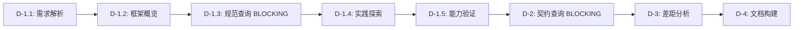

# SpecForge Enhanced Schema

> Fact-Based + Contract-First + Task-Tracked 的严谨技术设计工作流

---

## 概述

SpecForge Enhanced 是一个增强的 OpenSpec 工作流 schema，将 SpecForge 框架的核心能力整合到 OpenSpec 体系中，并引入了**任务追踪机制**确保每个步骤都被严格执行。

### 核心特性

| 特性 | 说明 |
|:---|:---|
| **Fact-Based Only** | 每个设计决策必须有 PRD 原文、MCP 查询结果或现有代码作为依据 |
| **Contract-First** | 后端接口必须先查询契约，否则禁止生成设计 |
| **Priority Waterfall** | L1 Explicit > L2 Pattern > L3 Ambiguous 的字段推导逻辑 |
| **Task-Tracked** ⭐ | 使用 TaskCreate/TaskUpdate/TaskList 工具追踪每个步骤 |
| **需求优先执行** ⭐ | 先理解需求，再有针对性地建立认知和验证实现 |
| **冲突处理机制** ⭐ | MCP-源码不一致时，参考规范和实践做出决策 |
| **多轮 Q&A 迭代** | 设计文档支持多轮用户确认和系统建议 |

---

## 工作流

```
proposal ──► specs ──► design ──► tasks ──► apply
                          │
                          └── 多轮 Q&A 迭代 + 任务追踪
                              ├── Round 1: 生成初始设计（8 个任务追踪）
                              │   D-1.1: proposal 需求解析
                              │   D-1.2: 技术框架概览
                              │   D-1.3: H5 开发规范查询 (BLOCKING)
                              │   D-1.4: 代码库最佳实践探索
                              │   D-1.5: 基建能力查询与验证（含冲突处理）
                              │   D-2: 后端接口契约查询 (BLOCKING)
                              │   D-3: 差距分析与问题生成
                              │   D-4: 文档构建与输出
                              │
                              ├── Round 2+: 用户答复 + 系统验证（5 个任务追踪）
                              │   R-1: 读取文件状态
                              │   R-2: MCP 验证与契约理解
                              │   R-3: 生成系统建议
                              │   R-4: 检查完成度
                              │   R-5: 更新状态或消化内容
                              │
                              └── 确认进入 tasks
```

---

## 任务追踪机制 (Task-Tracked)

### 核心价值

通过 Claude Code 的 Task 工具（TaskCreate、TaskUpdate、TaskList），确保 design 阶段的每个步骤都被严格执行，避免关键步骤被跳过。

### 设计生成阶段（8 个任务）

**执行逻辑**: 需求优先 → 针对性查询 → 交叉验证



| 任务 | 说明 | 关键点 |
|:---|:---|:---|
| **D-1.1** | proposal 需求解析 | 先知道要做什么，生成技术查询清单 |
| **D-1.2** | 技术框架概览 | 针对需求了解相关技术能力 |
| **D-1.3** | H5 开发规范查询 ⭐ | BLOCKING - 必须执行，学习权威规范 |
| **D-1.4** | 代码库最佳实践探索 | 寻找类似功能的实现参考 |
| **D-1.5** | 基建能力查询与验证 ⭐ | MCP + 源码交叉验证 + 冲突处理 |
| **D-2** | 后端接口契约查询 ⭐ | BLOCKING - 必须执行 |
| **D-3** | 差距分析与问题生成 | 识别缺失和歧义 |
| **D-4** | 文档构建与输出 | 引用规范和实践构建文档 |

### 设计评审阶段（5 个任务）

每轮评审都会创建 5 个任务追踪验证过程：

| 任务 | 说明 | 关键点 |
|:---|:---|:---|
| **R-1** | 读取文件状态 | 解析用户输入和当前状态 |
| **R-2** | MCP 验证与契约理解 | 重新查询验证用户答复 |
| **R-3** | 生成系统建议 | 在 SYSTEM_SUGGESTION 区写入建议 |
| **R-4** | 检查完成度 | 判断是否满足完成条件 |
| **R-5** | 更新状态或消化内容 | 未完成则继续迭代，已完成则固化内容 |

### 任务追踪规则

1. **创建**: 阶段开始前 MUST 调用 TaskCreate 创建所有任务
2. **更新**: 开始任务时设为 `in_progress`，完成时设为 `completed`
3. **验证**: 阶段完成后调用 TaskList 确认所有任务 `completed`
4. **清理**: 评审阶段开始前，删除上一轮的任务（避免混淆）

---

## 冲突处理机制

### 场景：MCP 查询结果与源码不一致

**发生在**: D-1.5 任务（基建能力查询与验证）

**处理流程**:

```
若 MCP 查询结果与源码不一致：

  Step 1: 参考 D-1.3 的开发规范
    → 规范是权威标准
    → 若规范明确 → 采纳规范，记录差异原因

  Step 2: 参考 D-1.4 的最佳实践
    → 现有实现是经验参考
    → 若实践一致 → 采纳实践，记录依据

  Step 3: 仍有歧义
    → 标记为 ⚠️ L3（有歧义）
    → 在 D-3 生成问题让用户确认
```

**示例**:

```yaml
场景：MCP 说 ZModal 只有 visible/onClose，源码用了 maskClosable

Step 1: 查 D-1.3 规范
  → 规范未提及 maskClosable

Step 2: 查 D-1.4 实践
  → memberCenter 模块使用了 maskClosable=false
  → memberBenefit 模块也使用了 maskClosable=false

Step 3: 决策
  → 采纳实践，记录："遵循项目实践，使用 maskClosable=false"
```

---

## 快速开始

### 1. 安装 Schema

```bash
# 方式一：命令行指定
openspec new change my-feature --schema specforge-enhanced

# 方式二：设置为项目默认
# 编辑 openspec/config.yaml
schema: specforge-enhanced
```

### 2. 创建变更

```bash
# 创建新变更
openspec new change add-referral-feature

# 快速生成所有 artifacts（推荐）
/opsx:ff

# 或逐步创建
/opsx:continue  # 创建 proposal
/opsx:continue  # 创建 design (开始任务追踪)
/opsx:continue  # 评审 design (多轮迭代)
/opsx:continue  # 创建 tasks
/opsx:apply     # 开始实施
```

### 3. 设计生成流程（带任务追踪）

```bash
用户: /opsx:continue  # 创建 design.md

Claude:
  → 识别阶段：design.md 不存在，进入设计生成阶段
  → 创建 8 个任务（D-1.1~D-4）
  → 执行 D-1.1: 读取 proposal，解析需求
  → 执行 D-1.2: 查询技术框架概览
  → 执行 D-1.3: 查询 H5 开发规范 (BLOCKING)
  → 执行 D-1.4: 探索代码库最佳实践
  → 执行 D-1.5: 查询基建能力并验证（含冲突处理）
  → 执行 D-2: 查询后端接口契约 (BLOCKING)
  → 执行 D-3: 分析差距并生成问题
  → 执行 D-4: 构建 design.md
  → 验证 TaskList：所有任务 completed ✅
  → 输出 design.md (Round 1 / ⏳ 待用户审查)
```

### 4. 设计评审流程（带任务追踪）

```bash
用户: [在 design.md 的 USER_INPUT 区填写答复]
用户: /opsx:continue  # 触发评审

Claude:
  → 识别阶段：design.md 已存在，进入设计评审阶段
  → 清理上一轮任务（若存在）
  → 创建 5 个任务（R-1~R-5）
  → 执行 R-1: 读取文件状态和用户输入
  → 执行 R-2: MCP 验证用户答复
  → 执行 R-3: 生成系统建议
  → 执行 R-4: 检查设计完成度
  → 执行 R-5: 更新状态或消化内容
  → 验证 TaskList：所有任务 completed ✅

  若未完成：
    → 输出 design.md (Round N+1 / ⏳ 待用户审查)

  若已完成：
    → 固化用户确认，清理临时区块
    → 输出 design.md (✅ 设计完成，可进入 tasks 阶段)
```

### 5. 监控任务进度

在设计过程中，可随时查看任务进度：

```bash
/tasks  # 查看当前任务列表

输出示例：
  ✅ D-1.1: proposal 需求解析 (completed)
  ✅ D-1.2: 技术框架概览 (completed)
  🔄 D-1.3: H5 开发规范查询 (in_progress)
  ⏳ D-1.4: 代码库最佳实践探索 (pending)
  ⏳ D-1.5: 基建能力查询与验证 (pending)
  ...
```

---

## 核心原则详解

### Fact-Based Only

- **PRD 原文**：功能描述、业务规则来自 PRD
- **MCP 查询结果**：接口契约、基建组件规格来自 MCP 工具
- **现有代码**：项目架构、命名规范来自代码库探索

❌ 禁止：编造 serviceCode、组件名、参数
✅ 正确：查不到就标记 MISSING，生成问题让用户补充

### Contract-First (BLOCKING)

后端接口必须先查询契约：

```yaml
# D-2 任务会执行：
1. 从 proposal 提取所有 serviceCode 和 operationName
2. 调用 mcp__contract-doc__get_contract_doc
3. 使用 Priority Waterfall 推导字段来源
4. 记录完整的入参表和返回值表
```

示例：
```javascript
mcp__contract-doc__get_contract_doc(
  serviceCode="31493",
  operationName="getReferralInfo"
)
```

### Priority Waterfall

| 级别 | 标记 | 判定 | 处理 |
|:---|:---|:---|:---|
| L1 | ✅ | PRD 明确 | 直接确认 |
| L2 | 🔧 | 符合惯例 | 用户无异议即确认 |
| L3 | ⚠️ | 有歧义 | 必须生成问题 |

详见 `design-generation` skill 中的 `references/field-inference.md`。

### Task-Tracked (核心创新)

**设计生成阶段**：8 个任务追踪完整流程

```
需求理解 (D-1.1)
  ↓ 生成查询清单
针对性认知建立 (D-1.2~D-1.4)
  ↓ 框架、规范、实践
实现验证 (D-1.5)
  ↓ MCP + 源码 + 冲突处理
完整性分析 (D-2~D-4)
  ↓ 契约、差距、文档
```

**设计评审阶段**：5 个任务追踪迭代过程

```
读取状态 (R-1)
  ↓
验证答复 (R-2)
  ↓
生成建议 (R-3)
  ↓
检查完成度 (R-4)
  ↓
更新或消化 (R-5)
```

---

## 需求优先的执行顺序

### 为什么需求优先？

**传统方式**（认知优先）:
```
先学技术 → 再看需求 → 容易跳步
```

**SpecForge Enhanced**（需求优先）:
```
先看需求 → 针对性学习 → 符合自然思维
```

**实际测试验证**: Claude Code agent 更愿意先读 proposal，基于此优化了执行顺序。

### 执行流程详解

#### 阶段 1: 需求理解 (D-1.1)

**目标**: 知道要做什么

```yaml
D-1.1: proposal 需求解析
  - 读取并解析 proposal
  - 提取需求逻辑（流程图、规则表、异常表）
  - 识别涉及的后端接口（serviceCode/operationName）
  - 识别需要的 UI 组件和功能
  - 生成技术查询清单 ← 为后续步骤做准备
```

**输出**: 技术查询清单（接口、组件、功能）

---

#### 阶段 2: 针对性认知建立 (D-1.2~D-1.4)

**目标**: 知道怎么做

##### D-1.2: 技术框架概览
```yaml
- 使用 querying-infra-catalog skill 的 overview 功能
- 针对 D-1.1 识别的需求，了解相关技术能力
- 建立技术认知基础
```

##### D-1.3: H5 开发规范查询 (BLOCKING) ⭐
```yaml
- MUST 调用 zx-h5-develop-experience skill
- 针对 D-1.1 识别的功能类型（如分享、埋点、请求等）
- 获取业务线的标准开发规范
- 作为后续实现的权威参考
```

**为什么是 BLOCKING**: 开发规范是权威标准，必须遵守，不能跳过。

##### D-1.4: 代码库最佳实践探索
```yaml
- 使用 Glob 和 Grep 工具进行全局代码库探索
- 针对 D-1.1 识别的需求，寻找类似功能的实现
- 提取最佳实践作为实现参考
```

**输出**: 规范文档 + 最佳实践清单

---

#### 阶段 3: 实现验证 (D-1.5)

**目标**: 验证怎么实现

##### D-1.5: 基建能力查询与验证 ⭐ 核心任务
```yaml
- 使用 querying-infra-catalog skill 查询 D-1.1 识别的组件/API
- 使用 Read 工具读取相关源码验证实际使用情况
- 对比 MCP 查询结果与源码实现
- 若不一致：执行冲突处理
```

**冲突处理**:
```
MCP ≠ 源码
  ↓
参考 D-1.3 规范
  ↓ 规范明确？
  Yes → 采纳规范
  No ↓
参考 D-1.4 实践
  ↓ 实践一致？
  Yes → 采纳实践
  No ↓
标记为 ⚠️ L3
  ↓
在 D-3 生成问题
```

**输出**: 组件规格清单（含置信度）+ 冲突处理决策

---

#### 阶段 4: 完整性分析 (D-2~D-4)

##### D-2: 后端接口契约查询 (BLOCKING)
```yaml
- 从 proposal 提取所有 serviceCode 和 operationName
- 对每个接口调用 mcp__contract-doc__get_contract_doc
- 使用 Priority Waterfall 推导字段来源
- 记录完整入参表和返回值表
```

##### D-3: 差距分析与问题生成
```yaml
- 对比需求与事实（D-1.5 的能力、D-2 的契约）
- 识别 MISSING 项和不一致项
- 按 L2 静默原则生成问题
- 按优先级分类：🔴 临界、🟡 重要、🟢 参考
```

##### D-4: 文档构建与输出
```yaml
- 按模板填充 design.md
- 引用 D-1.3 的规范作为实现约束
- 引用 D-1.4 的实践作为实现参考
- 更新状态为 Round 1 / ⏳ 待用户审查
```

---

## 依赖的 Skills

本 schema 引用了以下 skills（需在项目中安装）：

| Skill | 用途 | 调用位置 |
|:---|:---|:---|
| `querying-infra-catalog` | 查询组件/API 规格 | D-1.2 (overview), D-1.5 (search/specifications) |
| `zx-h5-develop-experience` | H5 开发规范 | D-1.3, apply |
| `ast-grep` | 结构化代码搜索指南 | D-1.4 (可选参考) |
| `task-planning` | 任务规划 | tasks artifact |

**注意**: 本 schema 已经整合了 `design-generation` skill 的逻辑，不需要直接调用该 skill。

---

## 执行示例

### 完整的 design 生成流程

```
用户需求: 实现火车票推荐有礼页面

▶ Round 1: 设计生成

  [创建任务]
  TaskCreate → 8 个任务创建完成

  [D-1.1] proposal 需求解析
  → 读取 proposal
  → 识别接口：service 31493, getReferralInfo
  → 识别组件：ZModal, XButton, XImage
  → 识别功能：分享、埋点
  → 生成查询清单 ✅

  [D-1.2] 技术框架概览
  → Skill(querying-infra-catalog) - overview
  → 了解 Xtaro-ZX 组件库和 NFES 框架
  → 针对 ZModal, XButton, XImage 了解能力 ✅

  [D-1.3] H5 开发规范查询 (BLOCKING)
  → Skill(zx-h5-develop-experience)
  → 获取分享规范：必须使用 zShare API
  → 获取埋点规范：必须在组件挂载时埋点
  → 获取请求规范：必须使用 zRequest ✅

  [D-1.4] 代码库最佳实践探索
  → Glob("app/member*/")
  → Read app/memberCenter/client.jsx
  → 提取实践：page.jsx + index.jsx + client.jsx
  → 提取实践：ZModal 使用 maskClosable=false ✅

  [D-1.5] 基建能力查询与验证
  → Skill(querying-infra-catalog) - search/specifications
  → MCP 返回：ZModal (visible, onClose, children)
  → Read 源码：ZModal (visible, onClose, maskClosable, children)
  → 冲突处理：
    - 参考 D-1.3 规范：未提及 maskClosable
    - 参考 D-1.4 实践：使用 maskClosable=false
    - 决策：采纳实践 ✅

  [D-2] 后端接口契约查询 (BLOCKING)
  → mcp__contract-doc__get_contract_doc(31493, getReferralInfo)
  → 记录入参表和返回值表 ✅

  [D-3] 差距分析与问题生成
  → 识别 MISSING：分享方式未明确
  → 生成问题：Q1 (🟡) 分享方式？ ✅

  [D-4] 文档构建与输出
  → 填充 design.md
  → 引用 D-1.3 规范（分享、埋点、请求）
  → 引用 D-1.4 实践（文件结构、组件使用）
  → 输出 design.md ✅

  [验证]
  TaskList → 所有任务 completed ✅

▶ Round 2: 设计评审

  [用户答复]
  Q1: 选择"微信分享"

  [创建任务]
  TaskCreate → 5 个任务创建完成

  [R-1] 读取文件状态
  → 解析用户答复：Q1 = 微信分享 ✅

  [R-2] MCP 验证
  → 验证微信分享：需要 zShare API（D-1.3 规范已包含）✅

  [R-3] 生成系统建议
  → 建议：使用 zShare.shareToWechat() ✅

  [R-4] 检查完成度
  → 所有问题已解决 ✅

  [R-5] 消化内容
  → 固化用户确认
  → 更新状态：✅ 设计完成 ✅

  [验证]
  TaskList → 所有任务 completed ✅

▶ 进入 tasks 阶段
  /opsx:continue
```

---

## 与 SpecForge 的关系

本 schema 将 SpecForge 的核心能力整合并增强：

| SpecForge | SpecForge Enhanced |
|:---|:---|
| `design-generator-agent.md` | schema.yaml 的 D-1.1~D-4 任务 |
| `design-review-agent.md` | schema.yaml 的 R-1~R-5 任务 |
| Priority Waterfall | 整合到 D-2 和 R-2 任务中 |
| MCP 查询规则 | 整合到 D-1.5, D-2, R-2 任务中 |
| `implementation_design.md.template` | `templates/design.md` |
| **无** | **Task 追踪机制** ⭐ 新增 |
| **无** | **冲突处理机制** ⭐ 新增 |
| **无** | **需求优先执行** ⭐ 新增 |

---

## 目录结构

```
specforge-enhanced/
├── schema.yaml                      # 工作流定义（含任务追踪）
├── config.example.yaml              # 项目配置示例
├── README.md                        # 本文档
├── templates/                       # 文档模板
│   ├── proposal.md
│   ├── spec.md
│   ├── design.md
│   └── tasks.md
└── docs/                            # 详细文档
    ├── TASK_TRACKING.md             # 任务追踪机制详解
    ├── EXECUTION_ORDER_V2.md        # 执行顺序优化说明
    ├── FINAL_VERIFICATION_V2.md     # 最终验证报告
    └── FINAL_REVIEW_REPORT.md       # 完整复盘报告
```

---

## 配置示例

### 最小配置

在项目的 `openspec/config.yaml` 中：

```yaml
schema: specforge-enhanced

context: |
  Tech stack: React + NFES + Xtaro-ZX
  Package manager: npm
```

### 完整配置

```yaml
schema: specforge-enhanced

context: |
  Tech stack: React + NFES + Xtaro-ZX
  Package manager: npm

  ## Fact-Based Development
  - 所有设计决策必须基于事实
  - 严禁编造不存在的能力、组件或接口

  ## Contract-First
  - 后端接口必须先查询契约

  ## Priority Waterfall
  - L1 Explicit: PRD 明确 → 直接确认
  - L2 Pattern: 符合惯例 → 用户无异议即确认
  - L3 Ambiguous: 有歧义 → 必须生成问题

rules:
  design:
    - MUST 遵循 design-generation skill 的执行流程
    - MUST 使用 querying-infra-catalog skill 来获取基建知识
    - MUST 遵循 zx-h5-develop-experience skill 的开发规范

    # Task-Tracked Workflow (CRITICAL!)
    - MUST 使用 TaskCreate/TaskUpdate/TaskList 工具追踪设计流程
    - 设计生成阶段: 创建 8 个任务
    - 设计评审阶段: 创建 5 个任务
    - 每个任务开始前设为 in_progress，完成后设为 completed
```

---

## 高级功能

### 1. 自定义任务粒度

如果需要更细或更粗的任务粒度，可以修改 `schema.yaml` 中的任务定义。

### 2. 自定义冲突处理规则

在 `config.yaml` 中添加项目特定的冲突处理规则：

```yaml
rules:
  design:
    - |
      冲突处理规则（D-1.5）:
      - 规则 1: 若涉及安全功能，优先采纳规范
      - 规则 2: 若涉及 UI 样式，优先采纳实践
      - 规则 3: 其他情况按标准流程（规范 > 实践 > 歧义）
```

### 3. 监控与调试

使用 `/tasks` 命令实时查看任务进度：

```bash
# 查看所有任务
/tasks

# 如果发现某个步骤被跳过
# 提醒 Claude: "请检查 D-1.3 任务状态"
```

---

## 常见问题

### Q1: 为什么要使用任务追踪？

**A**: 防止关键步骤被跳过。实际测试发现，没有任务追踪时，agent 可能会跳过 H5 规范查询、契约查询等关键步骤。

### Q2: 为什么需求优先而不是认知优先？

**A**: 实际测试发现，agent 更倾向于先读 proposal。需求优先符合自然思维，agent 更愿意执行，且查询更有针对性。

### Q3: D-1.5 的冲突处理什么时候触发？

**A**: 当 MCP 查询结果与源码实际使用不一致时触发。例如：
- MCP 说组件有 A、B 属性
- 源码使用了 A、B、C 属性
- 触发冲突处理：参考规范和实践决定是否使用 C

### Q4: BLOCKING 标记的含义？

**A**:
- **D-1.3 (H5 规范)**: 规范是权威标准，必须查询
- **D-2 (契约查询)**: Contract-First 原则，必须执行

### Q5: 如何知道所有任务都完成了？

**A**: 每个阶段完成后，agent 会调用 TaskList 验证所有任务状态为 `completed`。用户也可以随时使用 `/tasks` 命令查看。

### Q6: 评审阶段的任务会重复创建吗？

**A**: 每轮评审会删除上一轮的任务，创建新的 R-1~R-5 任务，避免混淆。

---

## 故障排查

### 问题：Agent 跳过了某个步骤

**检查**:
```bash
/tasks  # 查看任务状态
```

**可能原因**:
1. 任务未创建 → 检查 schema.yaml 是否有 "MUST 在开始前创建任务列表"
2. 任务状态未更新 → 提醒 agent 更新任务状态
3. Agent 不理解配置 → 检查配置文件是否有语法错误

**解决**:
```
提醒 Claude: "请检查任务列表，确保所有任务都已 completed"
```

### 问题：MCP 查询失败

**检查**:
- D-2 任务状态是否停留在 `in_progress`
- design.md 是否有 MISSING 标记

**解决**:
- 提供正确的 serviceCode 和 operationName
- 或告知 Claude 跳过该接口（标记为 MISSING）

### 问题：规范和实践冲突

**检查**:
- D-1.5 任务是否正确执行了冲突处理
- design.md 中是否有冲突处理的决策记录

**解决**:
- 检查 D-1.3 的规范查询结果
- 检查 D-1.4 的实践探索结果
- 若仍有歧义，应该在 D-3 生成问题

---

## 最佳实践

### 1. 充分利用任务追踪

设计阶段随时使用 `/tasks` 查看进度，确保所有关键步骤都已完成。

### 2. 重视 BLOCKING 任务

- **D-1.3 (H5 规范)**: 不查规范，生成的设计可能不符合业务线标准
- **D-2 (契约查询)**: 不查契约，无法生成准确的接口设计

### 3. 信任冲突处理机制

当 MCP 与源码不一致时，冲突处理机制会参考规范和实践做出合理决策。如果决策不合理，会生成问题让用户确认。

### 4. 多轮评审的耐心

design.md 可能需要 2-3 轮评审才能完成。每轮评审都会创建 5 个任务追踪验证过程，确保质量。

---

## 版本历史

### v2.1 (2026-02-04) - 执行顺序优化

- ⭐ 引入任务追踪机制（8 个生成任务 + 5 个评审任务）
- ⭐ 优化执行顺序为需求优先（基于实际测试反馈）
- ⭐ 新增冲突处理机制（MCP vs 源码）
- ✅ 明确 Task 工具与 skill 的关系
- ✅ 所有任务引用关系正确
- ✅ schema.yaml 与 config.yaml 完全一致

### v2.0 (之前版本)

- Fact-Based + Contract-First 原则
- Priority Waterfall 字段推导
- 多轮 Q&A 迭代

---

## 自定义与扩展

### 修改任务粒度

编辑 `schema.yaml` 中的任务定义，增加或减少任务：

```yaml
# 如果想更细粒度，可以拆分 D-1.5
D-1.5.1: 基建能力查询（MCP）
D-1.5.2: 源码验证
D-1.5.3: 冲突处理
```

### 修改冲突处理规则

在 `schema.yaml` 的冲突处理部分添加项目特定规则：

```yaml
**冲突处理 (D-1.5 专用):**
- 若 MCP 查询结果与源码不一致：
  1. 参考 D-1.3 的开发规范：规范是权威标准
  2. 参考 D-1.4 的最佳实践：现有实现是经验参考
  3. [新增] 若涉及安全功能，优先采纳规范
  4. 若规范和实践给出明确指引 → 采纳并记录差异原因
  5. 若仍有歧义 → 标记为 ⚠️ L3，在 D-3 生成问题让用户确认
```

### 调整模板

编辑 `templates/design.md` 来调整文档结构。

---

## 性能优化

### 并行执行

虽然任务有依赖关系，但某些步骤可以并行：

```yaml
# 可以并行执行（如果 agent 支持）
D-1.2 (框架概览) ∥ D-1.3 (规范查询) ∥ D-1.4 (实践探索)
```

目前是串行执行，未来版本可能支持并行优化。

### 缓存机制

D-1.2~D-1.4 的查询结果可以在同一项目的不同 change 间复用（未来可能支持）。

---

## 贡献与反馈

### 发现问题？

请在项目中创建 issue，描述：
1. 哪个任务执行有问题
2. 预期行为 vs 实际行为
3. 相关的配置和日志

### 优化建议？

欢迎提出：
1. 任务粒度调整建议
2. 冲突处理规则优化
3. 新的 skill 集成建议

---

## 相关文档

- [任务追踪机制详解](TASK_TRACKING.md)
- [执行顺序优化说明](EXECUTION_ORDER_V2.md)
- [最终验证报告](FINAL_VERIFICATION_V2.md)
- [完整复盘报告](FINAL_REVIEW_REPORT.md)

---

## 总结

SpecForge Enhanced 通过引入**任务追踪机制**和**需求优先执行顺序**，确保 Claude Code agent 严格遵循 Fact-Based + Contract-First 原则，生成高质量的技术设计文档。

**核心优势**:
- ✅ 每个步骤都有任务追踪，防止跳步
- ✅ 需求优先符合自然思维，agent 更愿意执行
- ✅ MCP-源码交叉验证，确保准确性
- ✅ 冲突处理机制，自动解决不一致
- ✅ 实际测试验证，生产级质量

**适用场景**:
- React + NFES + Xtaro-ZX 技术栈的 H5 项目
- 需要严格技术设计的复杂功能开发
- 多团队协作，需要清晰的技术文档
- 质量要求高，需要防止设计遗漏

**开始使用**:
```bash
openspec new change my-feature --schema specforge-enhanced
/opsx:ff
```
