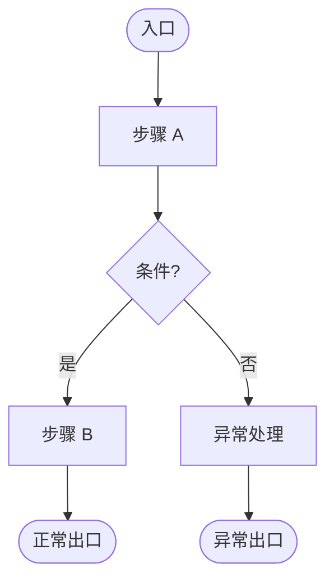

# design - [需求名称]

> 📖 **快速指南**：确认以下 3 项即可进入tasks阶段：
>
> | 步骤 | 确认项 | 操作 |
> |:---|:---|:---|
> | 1️⃣ | **需求逻辑** | 确认对需求的理解是否正确 |
> | 2️⃣ | **外部依赖** | 确认接口和组件的使用方式 |
> | 3️⃣ | **代码变更范围** | 确认变更位置是否合理 |
>
> 在各章节末尾的确认区输入意见。无异议可留空或输入 `确认`。

---

## 📊 当前状态

- 轮次: Round 1
- 状态: ⏳ 待用户审查

---

## 🤔 待决策问题

> 仅当存在跨章节或无法归类的问题时，此章节才会出现。

### 🔴 问题 1: [问题标题]

**说明**：[问题描述]

**可选方案**：
- [ ] 方案 A: [说明]
- [ ] 方案 B: [说明]

**用户意见**：

<!-- USER_INPUT_START:Q1 -->

<!-- USER_INPUT_END:Q1 -->

**AI 建议**：
<!-- SYSTEM_SUGGESTION_START:Qx --> 
... 
<!-- SYSTEM_SUGGESTION_END:Qx -->
---

## 🏗️ 需求逻辑 [待确认]

> 确认：AI 对需求的理解是否正确？数据流转、业务规则、异常处理是否完整？

### 流程图

> 1. 根据需求逻辑绘制 Mermaid 流程图。
> 2. 为了确保在所有渲染器中正常显示，必须严格遵守：
> - 声明： 使用 graph TD 作为首行声明。
> - 节点定义： 严禁直接连接文字，必须使用 ID[文字] 格式。
>   - 正确： A[入口] --> B{条件}
>   - 错误： 入口 --> 条件
> - 形状规范：
>   - 开始/结束：([文字]) —— 药丸形
>   - 普通步骤：[文字] —— 矩形
>   - 判断/分支：{文字} —— 菱形
> - 特殊字符： 节点文字内若含特殊符号（如 ?, !, &），必须包裹在双引号内，例如 A["步骤(带括号)"]。
> 3. 输出格式: 仅输出 Mermaid 代码块,不输出任何多余的解释文字或 Markdown 标题。

### 业务规则和异常处理

| 规则 ID | 触发条件 | 处理逻辑 | 边界条件 |
|:---|:---|:---|:---|
| R1 | [条件] | [处理] | [边界] |

---

**用户意见**：

<!-- USER_INPUT_START:BUSINESS_LOGIC -->

（审查以上需求逻辑是否正确。无异议可留空）

<!-- USER_INPUT_END:BUSINESS_LOGIC -->

---

## 🧾 外部依赖与接口 [待确认]

> 确认：接口调用方式、组件使用方式是否正确？
>
> **标记说明**：✅ PRD明确 | 🔧 推导（无异议视为确认） | ⚠️ 待确认 | ❌ 缺失

### 后端接口

#### `[serviceCode]/[operationName]` [状态]

- **用途**：[功能描述]
- **调用时机**：[何时调用]

**入参**（根据 `get_contract_doc` 返回的契约填写）：

| 字段路径 | 类型 | 必填 | 来源 | 示例值 | 状态 |
|:---|:---|:---|:---|:---|:---|
| [字段名] | [类型] | [是/否] | [来源] | [示例] | [✅/🔧/⚠️] |
| [父字段].[子字段] | [类型] | [是/否] | [来源] | [示例] | [状态] |

> **嵌套展开规则**：当契约中字段类型为 `object` 或 `array` 时，**必须**使用 `父字段.子字段` 格式展开所有层级，确保实施阶段能准确理解数据结构。

**返回值**（根据 `get_contract_doc` 返回的契约填写）：

| 字段路径 | 类型 | 说明 | 示例值 |
|:---|:---|:---|:---|
| [字段名] | [类型] | [用途说明] | [示例] |
| [父字段].[子字段] | [类型] | [用途说明] | [示例] |
| [父字段].[数组字段][] | [元素类型] | [用途说明] | - |
| [父字段].[数组字段][].[子字段] | [类型] | [用途说明] | [示例] |

> **复杂类型定义**（可选，当结构复杂时提供 TypeScript 类型定义，便于实施阶段参考）

---

### 基建组件

#### `[ComponentName]` [状态]

- **用途**：[功能描述]
- **使用方式**：[直接使用/封装]
- **关键配置**：[配置项]
- **限制**：[已知限制]

---

**用户意见**：

<!-- USER_INPUT_START:DEPENDENCIES -->

（审查以上接口和组件使用是否正确。无异议可留空）

<!-- USER_INPUT_END:DEPENDENCIES -->

---

## 📁 代码变更范围 [待确认]

> 确认：新文件位置、已有文件改动点是否合理？

### 影响范围

| 模块 | 文件路径 | 操作 | 变更说明 |
|:---|:---|:---|:---|
| [模块名] | `/xxx/xxx/index.jsx` | 新建 | [说明] |
| [模块名] | `/xxx/xxx/service.js` | 修改 | 增加 [内容] |

### 共享资源与风险点

| 资源 | 影响 | 风险/建议 |
|:---|:---|:---|
| `package.json` | 全局 | 确认依赖版本兼容 |

---

**用户意见**：

<!-- USER_INPUT_START:IMPACT -->

（审查以上代码变更范围是否合理。无异议可留空）

<!-- USER_INPUT_END:IMPACT -->

---

## ✅ 验收标准

### 通用标准

- [ ] 需求逻辑实现符合「需求逻辑」章节
- [ ] 接口调用符合「外部依赖与接口」章节
- [ ] 代码变更符合「代码变更范围」章节

### 非 TDD 模式

- [ ] 代码审查无明显逻辑错误
- [ ] 边界条件和异常处理已落实

### TDD 模式（若启用）

- [ ] 核心需求逻辑有测试覆盖
- [ ] 测试通过

---

## 🔍 审查历史

- **Round 1**: 初始生成