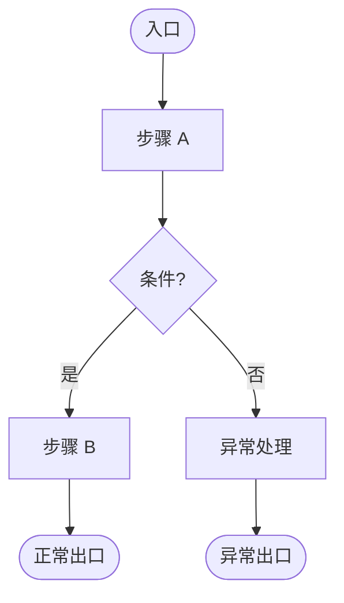

# proposal - [需求名称]

## 🤔 待决策问题

>包含需求中的逻辑断点、歧义、信息盲区

### 🔴 问题 1: [问题标题]

**说明**：[问题描述]

**可选方案**：

- [ ] 方案 A: [说明]
- [ ] 方案 B: [说明]

**用户意见**：

<!-- USER_INPUT_START:Q1 -->

<!-- USER_INPUT_END:Q1 -->

**AI 建议**：

<!-- SYSTEM_SUGGESTION_START:Qx -->

...

<!-- SYSTEM_SUGGESTION_END:Qx -->

### 🔴 我无需关心的部分: （需要忽略的功能模块）

**说明**：[问题描述]

**可能需要忽略的部分**：

- [ ] 方案 A: [说明]
- [ ] 方案 B: [说明]

**用户意见**：

<!-- USER_INPUT_START:Q1 -->

（输入需要忽略的部分，例如某些功能模块、前后端部分等。无意见可留空）

<!-- USER_INPUT_END:Q1 -->

**AI 建议**：

<!-- SYSTEM_SUGGESTION_START:Qx -->

...

<!-- SYSTEM_SUGGESTION_END:Qx -->

## 需求概述

> 简要概述背景与目标、功能范围、用户故事与用例

## 功能逻辑详述

> 按重要性划分详细描述需求功能点

---

**用户意见**：

<!-- USER_INPUT_START:FEATURE -->

（审查以上功能逻辑详述是否正确。无异议可留空）

<!-- USER_INPUT_END:FEATURE -->

---

## 业务逻辑流程图

> 1. 根据需求逻辑绘制 Mermaid 流程图。
> 2. 为了确保在所有渲染器中正常显示，必须严格遵守：
>
> - 声明： 使用 graph TD 作为首行声明。
> - 节点定义： 严禁直接连接文字，必须使用 ID[文字] 格式。
>   - 正确： A[入口] --> B{条件}
>   - 错误： 入口 --> 条件
> - 形状规范：
>   - 开始/结束：([文字]) —— 药丸形
>   - 普通步骤：[文字] —— 矩形
>   - 判断/分支：{文字} —— 菱形
> - 特殊字符： 节点文字内若含特殊符号（如 ?, !, &），必须包裹在双引号内，例如 A["步骤(带括号)"]。
>
> 3. 输出格式: 仅输出 Mermaid 代码块,不输出任何多余的解释文字或 Markdown 标题。

<!-- 纯 Mermaid 代码块，必须包含所有逻辑节点与 subgraph 分区 -->

---

**用户意见**：

<!-- USER_INPUT_START:BUSINESS_LOGIC -->

（审查以上需求逻辑是否正确。无异议可留空）

<!-- USER_INPUT_END:BUSINESS_LOGIC -->

---

## 需求修改建议

> 持久保留 需求修改建议 模块，直到用户明确说明无修改意见时去除

**用户意见**：

<!-- USER_INPUT_START:Q1 -->

（输入需要忽略的部分，例如某些功能模块、前后端部分等。无意见可留空）

<!-- USER_INPUT_END:Q1 -->
